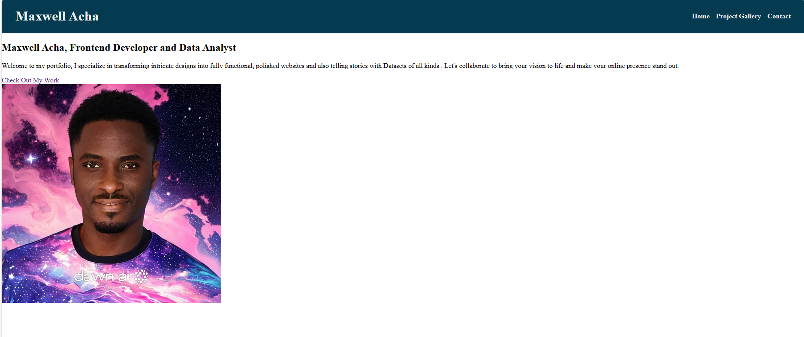

# Maxwell Acha's React-portfolio

## Description
Welcome to the Modern Development with React: React Portfolio project! Now that you've worked with React and have multiple projects to share, it's time to develop the initial scaffolding for your first portfolio site, as well as create or update other materials so that you can showcase your skills to potential employers. Creating a portfolio using React will help set you apart from other developers whose portfolios do not use some of the latest technologies.

## Screenshot

## Project Objectives
Build a Modern Portfolio: Develop a dynamic portfolio website using React to showcase your projects and skills.
Demonstrate React Skills: Apply your React knowledge to create a responsive and visually appealing portfolio.
Enhance Career Opportunities: Use this portfolio to present your work to potential employers and stand out in the job market.
Stay Current: Keep up with the latest technologies and trends in web development.

## Overview
This portfolio website serves as a hub for potential employers and collaborators to explore my skills and projects. It includes the following sections:

Home: A welcoming landing page with my name, a brief introduction, and a link to my portfolio.

Projects: A section highlighting the projects I've worked on, with project titles, descriptions, images, and links to both GitHub repositories and deployed versions.

Contact: A form where visitors can get in touch with me. Upon submitting the form, users receive feedback indicating that their message has been successfully submitted. Additionally, links to my social media profiles and a PDF download option for my CV are available.
